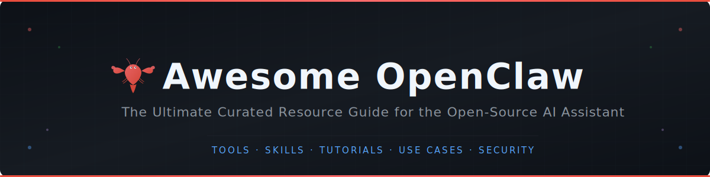

<div align="center">

<!-- BANNER -->

<br/><br/>

# 🦞 Awesome OpenClaw

### The Ultimate Curated Resource Guide for OpenClaw

<br/>

[](https://awesome.re)
[](https://github.com/openclaw/openclaw/releases)
[](https://creativecommons.org/publicdomain/zero/1.0/)
[](https://github.com/sagarjethi/awesome-openclaw/pulls)

<br/>

**A carefully curated, daily-driver resource guide for [OpenClaw](https://openclaw.ai/) — the open-source personal AI assistant.**

OpenClaw runs locally on your machine, connects to 50+ services, and lets you chat with AI through WhatsApp, Telegram, Discord, Slack, and more. Think of it as your AI employee that can browse the web, manage files, run commands, and automate your life.

<br/>

[🌐 Official Site](https://openclaw.ai/) · [💻 GitHub](https://github.com/openclaw/openclaw) · [📖 Docs](https://docs.openclaw.ai/) · [🧩 ClawHub Skills](https://github.com/openclaw/clawhub) · [📦 Releases](https://github.com/openclaw/openclaw/releases)


</div>

<br/>

---

## How to Use This List

> **🆕 New to OpenClaw?** Start with [Quick Start](#-quick-start) → [First Steps](#first-steps) → [Beginner Tutorials](#beginner)
>
> **📱 Setting up for daily use?** Jump to [Use Cases](USECASES.md) → [Messaging Integrations](#-messaging-integrations) → [Proactive Automation](#-proactive-automation-heartbeat--cron)
>
> **🏢 Deploying for a team?** See [Deployment](#-deployment--infrastructure) → [Enterprise](#-enterprise) → [Security](#-security--hardening)
>
> **🔨 Building with OpenClaw?** Check [Skills & Plugins](#-skills--plugins) → [MCP Support](#-mcp-model-context-protocol) → [Community Projects](#-community-projects)
>
> **📖 Want the backstory?** Read [Project Timeline](#-project-timeline) → [YouTube & Podcasts](#-youtube--podcasts) → [Articles & Media](#-articles--media)

---

## Contents

- [Official Resources](#-official-resources)
- [Quick Start](#-quick-start)
- [Use Cases](#-use-cases)
- [Proactive Automation](#-proactive-automation-heartbeat--cron)
- [LLM Providers](#-llm-providers)
- [Messaging Integrations](#-messaging-integrations)
- [Skills & Plugins](#-skills--plugins)
- [MCP (Model Context Protocol)](#-mcp-model-context-protocol)
- [Deployment & Infrastructure](#-deployment--infrastructure)
- [Enterprise](#-enterprise)
- [Security & Hardening](#-security--hardening)
- [Community Projects](#-community-projects)
- [Tutorials & Learning](#-tutorials--learning)
- [YouTube & Podcasts](#-youtube--podcasts)
- [News](#-news)
- [Articles & Media](#-articles--media)
- [Community & Events](#-community--events)
- [Alternatives & Comparisons](#-alternatives--comparisons)
- [Project Timeline](#-project-timeline)
- [Contributing](#contributing)

---

## 📌 Official Resources

| Resource | Description |
|----------|-------------|
| [OpenClaw Website](https://openclaw.ai/) | Official homepage and product overview |
| [GitHub Repository](https://github.com/openclaw/openclaw) | Main source code repository |
| [Documentation](https://docs.openclaw.ai/) | Official setup, configuration, and API docs |
| [ClawHub](https://github.com/openclaw/clawhub) | Official skill registry — 5,700+ community skills |
| [Releases](https://github.com/openclaw/openclaw/releases) | Changelog and versioned releases |
| [AGENTS.md](https://github.com/openclaw/openclaw/blob/main/AGENTS.md) | Multi-agent team configuration guide |
| [Security Docs](https://docs.openclaw.ai/gateway/security) | Official security guidelines and gateway config |
| [GitHub Issues](https://github.com/openclaw/openclaw/issues) | Bug reports, feature requests, and discussions |

### Key Files to Know

- **`AGENTS.md`** — Define your agent team hierarchy, roles, and delegation rules
- **`SOUL.md`** — Personality and behavioral instructions for your agent
- **`USER.md`** — Personal context (preferences, routines, contacts)
- **`HEARTBEAT.md`** — Autonomous task checklist the agent reviews on each heartbeat cycle
- **`openclaw.json`** — Main configuration file at `~/.openclaw/openclaw.json`

---

## 🚀 Quick Start

### Installation

```bash
# Recommended (one-liner)
curl -fsSL https://openclaw.ai/install.sh | bash

# Via npm
npm install -g openclaw@latest

# Via pnpm
pnpm add -g openclaw@latest

# Via Docker
docker pull openclaw/openclaw:latest
```

### First Steps

```bash
# 1. Run the onboarding wizard
openclaw onboard --install-daemon

# 2. Choose your LLM provider (Claude, OpenAI, Ollama, DeepSeek)
# 3. Connect a messaging platform (Telegram is easiest to start)
# 4. Start chatting!

# Access the web dashboard
open http://localhost:18789/
```

### Essential Commands

```bash
openclaw onboard          # Setup wizard
openclaw gateway          # Start the background daemon
openclaw skills install   # Install a skill from ClawHub
openclaw plugins install  # Install an npm-based plugin
openclaw status           # Check agent health
```

---

## 🏆 Use Cases

Detailed, community-verified use cases with full implementation guides, configs, and code. **[See all use cases →](USECASES.md)**

| Use Case | Category | Complexity | Description |
|----------|----------|:----------:|-------------|
| [Self-Healing Home Server](USECASES.md#1-self-healing-home-server) | Infrastructure | Advanced | Persistent agent that monitors, diagnoses, and fixes server issues autonomously |
| [Multi-Agent Team](USECASES.md#2-multi-agent-team-for-solo-founders) | Business | Advanced | Coordinated team of specialized agents via single Telegram group |
| [Family Calendar Assistant](USECASES.md#3-family-calendar--household-assistant) | Home & Life | Medium | Calendar aggregation, ambient monitoring, inventory tracking |
| [Daily Reddit Digest](USECASES.md#4-daily-reddit-digest) | Social Media | Easy | Personalized daily digest that learns your preferences |
| [YouTube Content Pipeline](USECASES.md#5-youtube-content-pipeline) | Content | Medium | Video idea scouting with semantic deduplication |
| [Personal Knowledge Base](USECASES.md#6-personal-knowledge-base-rag) | Research | Easy | Drop URLs → auto-ingest into searchable RAG knowledge base |
| [X Account Analysis](USECASES.md#7-x-twitter-account-analysis) | Social Media | Easy | Free alternative to paid analytics services |
| [Overnight Mini-App Builder](USECASES.md#8-goal-driven-autonomous-tasks-overnight-mini-app-builder) | Productivity | Medium | Agent generates and executes daily tasks aligned with your goals |
| [Polymarket Autopilot](USECASES.md#9-polymarket-autopilot-paper-trading) | Finance | Advanced | Simulated prediction market trading with backtesting |

> **External collections:** [25 Ways to Automate (Hostinger)](https://www.hostinger.com/tutorials/openclaw-use-cases) · [25+ Real Use Cases (Forward Future)](https://www.forwardfuture.ai/p/what-people-are-actually-doing-with-openclaw-25-use-cases) · [8 Advanced Use Cases (Jangwook)](https://jangwook.net/en/blog/en/openclaw-advanced-usage/) · [awesome-openclaw-usecases](https://github.com/hesamsheikh/awesome-openclaw-usecases)

---

## ⏰ Proactive Automation (Heartbeat & Cron)

OpenClaw doesn't just respond — it acts on its own. Two systems make this possible:

### Heartbeat (Interval-Based Sensing)

The Gateway daemon checks `HEARTBEAT.md` every 30 minutes (configurable). On each beat, the agent evaluates whether any task needs action.

```markdown
<!-- Example HEARTBEAT.md -->
- [ ] Check if inbox has urgent unread emails → notify me on Telegram
- [ ] Monitor deployment status → alert if any service is down
- [ ] Check flight status for upcoming trips → warn about delays
```

### Cron Jobs (Precise Scheduling)

For time-specific tasks. Jobs persist under `~/.openclaw/cron/` and survive restarts.

```bash
# Morning briefing at 8 AM weekdays
openclaw cron add "0 8 * * 1-5" "Send morning brief to Telegram"

# Weekly report on Fridays at 5 PM
openclaw cron add "0 17 * * 5" "Compile weekly summary and post to Slack"

# Monthly bill reminder on the 1st
openclaw cron add "0 9 1 * *" "Review upcoming bills and send payment reminders"
```

### When to Use Which

| Mechanism | Use For | Example |
|-----------|---------|---------|
| **Heartbeat** | Monitoring, reactive tasks | "If inbox has urgent email, notify me" |
| **Cron** | Scheduled, predictable tasks | "Every weekday at 8 AM, send briefing" |
| **Reactive (chat)** | On-demand requests | "Summarize this PDF" |
| **Multi-step workflows** | Stateful sequences | "Research → Draft → Review → Publish" |

> **Docs:** [Cron Jobs](https://docs.openclaw.ai/automation/cron-jobs) · [Cron & Heartbeat Guide](https://www.getopenclaw.ai/help/cron-heartbeat-automation) · [Proactive AI Guide](https://zenvanriel.nl/ai-engineer-blog/openclaw-cron-jobs-proactive-ai-guide/) · [Automated Morning Routine](https://openclawready.com/blog/openclaw-cron-jobs-daily-automation/)

---

## 🧠 LLM Providers

OpenClaw is provider-agnostic. You can switch models at any time.

### Cloud Providers

| Provider | Config Key | Notes |
|----------|-----------|-------|
| [Anthropic (Claude)](https://www.anthropic.com/) | `anthropic` | Auto-detected, just set `ANTHROPIC_API_KEY` |
| [OpenAI (GPT)](https://platform.openai.com/) | `openai` | Auto-detected, just set `OPENAI_API_KEY` |
| [DeepSeek](https://platform.deepseek.com/) | `deepseek` | Cost-effective alternative |
| [Google Gemini](https://ai.google.dev/) | `google` | Gemini models supported |
| [OpenRouter](https://openrouter.ai/) | `openrouter` | Access 100+ models through one API |
| [Hugging Face Inference](https://huggingface.co/inference-api) | `huggingface` | OpenAI-compatible, e.g. `deepseek-ai/DeepSeek-R1` |

### Local / Self-Hosted

| Runtime | Description | Best For |
|---------|-------------|----------|
| [Ollama](https://ollama.com/) | Auto-detected at `localhost:11434` | Quick local setup, great model library |
| [LM Studio](https://lmstudio.ai/) | GUI-based local inference | Experimenting with models before committing |
| [vLLM](https://github.com/vllm-project/vllm) | Production-grade serving, 24x faster than HF Transformers | High-throughput production workloads |
| [llama.cpp](https://github.com/ggml-org/llama.cpp) | CPU/GPU inference for GGUF models | Lightweight deployments |

### Custom Providers

Any OpenAI- or Anthropic-compatible endpoint works. Add custom providers via `models.providers` in your config:

```json
{
  "models": {
    "providers": {
      "my-proxy": {
        "baseUrl": "https://my-proxy.example.com/v1",
        "apiKey": "sk-..."
      }
    }
  }
}
```

> **Docs:** [Model Providers](https://docs.openclaw.ai/concepts/model-providers) · [Switching Models Guide](https://www.getopenclaw.ai/help/switching-models-provider-config)

---

## 💬 Messaging Integrations

Connect OpenClaw to the apps you already use daily.

### Built-in Channels

| Platform | Setup Difficulty | Notes |
|----------|:---:|-------|
| [Telegram](https://docs.openclaw.ai/) | ⭐ Easy | Recommended for beginners — Bot API, fastest setup |
| [WhatsApp](https://docs.openclaw.ai/) | ⭐⭐ Medium | Via WhatsApp Web bridge |
| [Discord](https://docs.openclaw.ai/) | ⭐⭐ Medium | Full bot integration |
| [Slack](https://docs.openclaw.ai/) | ⭐⭐ Medium | Workspace app |
| [Signal](https://docs.openclaw.ai/) | ⭐⭐⭐ Advanced | Via Signal CLI |
| [iMessage](https://docs.openclaw.ai/) | ⭐⭐ Medium | macOS only |
| [Microsoft Teams](https://docs.openclaw.ai/) | ⭐⭐ Medium | Enterprise ready |
| [Google Chat](https://docs.openclaw.ai/) | ⭐⭐ Medium | Google Workspace integration |
| [Matrix](https://docs.openclaw.ai/) | ⭐⭐⭐ Advanced | Decentralized, self-hosted chat |
| [BlueBubbles](https://docs.openclaw.ai/) | ⭐⭐⭐ Advanced | Cross-platform iMessage alternative |
| [WebChat](https://docs.openclaw.ai/) | ⭐ Easy | Browser-based at `localhost:18789` |
| [Zalo](https://docs.openclaw.ai/) | ⭐⭐ Medium | Popular in Vietnam |

### Chinese IM Integrations (Community)

| Platform | Repository | Stars |
|----------|-----------|:-----:|
| WeChat (微信) | [openclaw-wechat](https://github.com/freestylefly/openclaw-wechat) | 600+ |
| DingTalk (钉钉) | [dingtalk-openclaw-connector](https://github.com/DingTalk-Real-AI/dingtalk-openclaw-connector) | 1.2k+ |
| Feishu/Lark (飞书) | [openclaw-feishu](https://github.com/AlexAnys/openclaw-feishu) | 180+ |

> **Tutorial:** [Channel Setup Guide](https://openclaw-ai.online/tutorials/setup-channel/) · [WhatsApp Integration](https://www.digitalapplied.com/blog/openclaw-whatsapp-integration-messaging-automation-guide)

---

## 🔧 Skills & Plugins

Skills are text-based capabilities you install to extend what your agent can do.

### Skill Registries

| Registry | Skills | Description |
|----------|:------:|-------------|
| [ClawHub (Official)](https://github.com/openclaw/clawhub) | 5,700+ | Official registry with moderation and vector search |
| [awesome-openclaw-skills](https://github.com/VoltAgent/awesome-openclaw-skills) | 3,000+ | Community-curated collection |
| [openclaw-skills-directory](https://github.com/sundial-org/awesome-openclaw-skills) | 900+ | Top skills, regularly updated |
| [Skills Docs](https://docs.openclaw.ai/tools/skills) | — | Official skill development guide |

### Skill Categories at a Glance

| Category | What It Does | Example Skills |
|----------|-------------|----------------|
| **Productivity** | Calendar, email, tasks | Gmail, Google Calendar, Todoist |
| **Development** | Code, repos, CI/CD | GitHub PR reviews, deployment triggers |
| **Smart Home** | IoT, lights, devices | HomeKit, Philips Hue, MQTT |
| **Communication** | Drafting, scheduling | Email drafts, message scheduling |
| **Research** | Web, documents, data | Web browsing, PDF summarization |
| **Entertainment** | Media, music | Spotify control, media management |
| **Storage** | Files, cloud sync | [Fast.io](https://fast.io/) (workspaces for agentic teams) |
| **Finance** | Trading, analysis | Crypto automation, financial data |

### Installing Skills

```bash
# From ClawHub
openclaw skills install <skill-name>

# npm-based plugins
openclaw plugins install <npm-package>
```

### Building Your Own Skill

Each skill needs an `openclaw.plugin.json` manifest. Supports `.js` and `.ts` entry files.

> **Docs:** [Plugin Documentation](https://docs.openclaw.ai/tools/skills) · [Skill Development](https://docs.openclaw.ai/tools/skills)

> **⚠️ Safety Note:** Always vet skills before installing. Check the [VirusTotal report on ClawHub](https://github.com/openclaw/clawhub) for each skill. [230+ malicious skills were found](https://www.authmind.com/post/openclaw-malicious-skills-agentic-ai-supply-chain) on ClawHub since January 2026 — review source code before installing community skills.

---

## 🔗 MCP (Model Context Protocol)

OpenClaw does not yet have native MCP support, but the community has built several bridges.

### MCP Plugins & Bridges

| Project | Description |
|---------|-------------|
| [openclaw-mcp-adapter](https://github.com/androidStern-personal/openclaw-mcp-adapter) | Expose MCP server tools as native OpenClaw agent tools |
| [openclaw-mcp](https://github.com/freema/openclaw-mcp) | Bridge between Claude.ai and self-hosted OpenClaw (OAuth2) |
| [openclaw-mcp-plugin](https://github.com/lunarpulse/openclaw-mcp-plugin) | MCP via remote streamable HTTP transport |

### Feature Requests (Track Progress)

| Issue | Status | Description |
|-------|--------|-------------|
| [#4834](https://github.com/openclaw/openclaw/issues/4834) | Open | Native MCP support |
| [#13248](https://github.com/openclaw/openclaw/issues/13248) | Open | Full MCP support request |
| [#8188](https://github.com/openclaw/openclaw/issues/8188) | Open | MCP client support |
| [PR #5121](https://github.com/openclaw/openclaw/pull/5121) | Merged | MCP server support (callable from external tools) |

---

## 🏗️ Deployment & Infrastructure

### Quick Reference: Choose Your Deployment

| Method | Best For | Difficulty |
|--------|----------|:----------:|
| Local install | Personal use, development | ⭐ |
| Docker Compose | Isolated local/server deployments | ⭐⭐ |
| [Moltworker (Cloudflare)](https://github.com/cloudflare/moltworker) | Serverless, fully sandboxed | ⭐⭐ |
| [DigitalOcean One-Click](https://www.digitalocean.com/community/tutorials/how-to-run-openclaw) | Cloud VPS | ⭐⭐ |
| [Zeabur Template](https://zeabur.com/templates/VTZ4FX) | One-click PaaS deployment | ⭐ |
| [Vultr Guide](https://docs.vultr.com/how-to-deploy-openclaw-autonomous-ai-agent-platform) | Cloud VPS deployment | ⭐⭐ |
| [Hostinger Guide](https://www.hostinger.com/tutorials/how-to-set-up-openclaw) | Budget VPS hosting | ⭐⭐ |
| Kubernetes | Enterprise, multi-agent fleets | ⭐⭐⭐ |

### Docker Setup

```bash
# Clone and run the setup script
git clone https://github.com/openclaw/openclaw.git
cd openclaw
./docker-setup.sh
```

> The gateway runs on your host machine; agent sessions spin up in isolated containers. This gives you containerization security without sacrificing integration capabilities.

### Community Deployment Tools

| Project | Stars | Description |
|---------|:-----:|-------------|
| [moltworker](https://github.com/cloudflare/moltworker) | 7.9k | Run OpenClaw on Cloudflare Workers (fully sandboxed) |
| [OpenClawInstaller](https://github.com/miaoxworld/OpenClawInstaller) | 1.7k | One-click deployment tool |

> **Guides:** [Docker Secure Setup (Simon Willison)](https://til.simonwillison.net/llms/openclaw-docker) · [Docker Guide (Towards Dev)](https://medium.com/towardsdev/run-openclaw-moltbot-clawdbot-safely-with-docker-a-practical-guide-for-beginners-94112a9b57be) · [Production Deployment](https://open-claw.org/posts/openclaw-deploy)

---

## 🏢 Enterprise

### Key Features for Teams

- **RBAC** — Three roles: Admin (global config), Developer (use agent + personal logs), Auditor (read-only compliance)
- **Audit Logging** — Every workflow execution logged with timestamp, agent ID, nodes traversed, API calls, and outcomes
- **Data Residency** — Self-hosted architecture means data never leaves your infrastructure
- **SSO/SAML** — Available via community plugins

### Enterprise Projects

| Project | Stars | Description |
|---------|:-----:|-------------|
| [SafeClaw](https://safeclaw.dev/) | — | Enterprise security layer for OpenClaw agents |
| [Clawctl](https://www.clawctl.com/) | — | Managed hosting with audit trails, CSV/JSON export, 365-day retention |

### Compliance Mapping

| Framework | OpenClaw Mapping |
|-----------|-----------------|
| SOC 2 (CC7.2) | Audit logs capture all AI interactions |
| GDPR | Self-hosted = full data control, no third-party processing |
| HIPAA | Configurable with proper network isolation and encryption |

> **Guide:** [Enterprise Security & Compliance](https://www.getopenclaw.ai/how-to/enterprise-security-compliance) · [Enterprise Deployment (Multi-User)](https://eastondev.com/blog/en/posts/ai/20260205-openclaw-enterprise-deploy/)

---

## 🔒 Security & Hardening

### Critical: CVE-2026-25253 (RCE)

A critical vulnerability (CVSS 8.8) was disclosed January 30, 2026. An attacker-controlled web page could trigger remote code execution on your machine.

- **Fix:** Update to **v2026.1.29 or later** immediately
- **Post-update:** Rotate all auth tokens
- **Details:** [NVD Entry](https://nvd.nist.gov/vuln/detail/CVE-2026-25253) · [SOCRadar Analysis](https://socradar.io/blog/cve-2026-25253-rce-openclaw-auth-token/) · [Belgium CERT Advisory](https://ccb.belgium.be/advisories/warning-critical-vulnerability-openclaw-allows-1-click-remote-code-execution-when)

### Hardening Checklist

- [ ] **Update to latest version** — always run the latest release
- [ ] **Never expose to public internet** — the web UI is not hardened for public access
- [ ] **Use Docker** — run agents in isolated containers with read-only filesystems
- [ ] **Drop capabilities** — run as non-root, mount only needed directories
- [ ] **Set API billing alerts** — configure alerts at $25, $50, $100
- [ ] **Vet all skills** — read source code before installing; check VirusTotal on ClawHub
- [ ] **Use environment variables** — never hardcode API keys
- [ ] **Reverse proxy + auth** — mandatory for any non-localhost access
- [ ] **Segment access** — agents don't need access to all Gmail, all Slack, all databases simultaneously
- [ ] **Rotate tokens regularly** — especially after any security update

### Threat Landscape

| Threat | Description | Mitigation |
|--------|-------------|------------|
| Exposed instances | [42,000+ instances found online](https://www.infosecurity-magazine.com/news/researchers-40000-exposed-openclaw) | Never expose to internet; use VPN |
| Malicious skills | [230+ malicious skills on ClawHub](https://www.authmind.com/post/openclaw-malicious-skills-agentic-ai-supply-chain) | Vet source code; check VirusTotal |
| Prompt injection | Malicious instructions embedded in emails/web pages | Limit ingestion sources; use sandboxing |
| Token exfiltration | CVE-2026-25253 auth token leak | Update to v2026.1.29+; rotate tokens |

### Security Reading

- [CrowdStrike: What Security Teams Need to Know](https://www.crowdstrike.com/en-us/blog/what-security-teams-need-to-know-about-openclaw-ai-super-agent/) — Comprehensive enterprise threat analysis
- [Sophos: Warning Shot for Enterprise AI Security](https://www.sophos.com/en-us/blog/the-openclaw-experiment-is-a-warning-shot-for-enterprise-ai-security) — Defense-in-depth perspective
- [Aikido: Why Trying to Secure OpenClaw is Ridiculous](https://www.aikido.dev/blog/why-trying-to-secure-openclaw-is-ridiculous) — Honest assessment of the security surface
- [JFrog: Giving OpenClaw the Keys to Your Kingdom](https://jfrog.com/blog/giving-openclaw-the-keys-to-your-kingdom-read-this-first/) — Supply chain security analysis
- [VentureBeat: Your Security Model Doesn't Work](https://venturebeat.com/security/openclaw-agentic-ai-security-risk-ciso-guide) — CISO guide to agentic AI risk
- [xCloud: 7 Security Best Practices](https://xcloud.host/openclaw-security-best-practices/) — Practical hardening steps
- [Adversa.ai: Security 101](https://adversa.ai/blog/openclaw-security-101-vulnerabilities-hardening-2026/) — CVE walkthrough and hardening guide

---

## 🛠️ Community Projects

### Web Clients & UIs

| Project | Stars | Description |
|---------|:-----:|-------------|
| [webclaw](https://github.com/ibelick/webclaw) | 478+ | Fast, minimal web client for OpenClaw |

### Memory & Context

| Project | Stars | Description |
|---------|:-----:|-------------|
| [memU](https://github.com/mem0ai/mem0) | 8k | Persistent long-term memory for proactive agents |

---

## 📚 Tutorials & Learning

### Beginner

| Tutorial | Source | What You'll Learn |
|----------|--------|-------------------|
| [Installation to First Chat](https://www.codecademy.com/article/open-claw-tutorial-installation-to-first-chat-setup) | Codecademy | Full setup walkthrough |
| [What is OpenClaw?](https://www.digitalocean.com/resources/articles/what-is-openclaw) | DigitalOcean | Comprehensive explainer |
| [Control Your PC from WhatsApp](https://www.datacamp.com/tutorial/moltbot-clawdbot-tutorial) | DataCamp | WhatsApp + PC automation |
| [10 Steps to Set Up Your Agent](https://advenboost.com/en/openclaw-setup-10-steps-guide/) | AdvenBoost | Step-by-step guide |
| [Complete 101 Guide](https://sidsaladi.substack.com/p/openclawmoltbotclawdbot-101-the-complete) | Substack | Everything from scratch |

### Intermediate

| Tutorial | Source | What You'll Learn |
|----------|--------|-------------------|
| [Using OpenClaw with Ollama](https://www.datacamp.com/tutorial/openclaw-ollama-tutorial) | DataCamp | Local data analyst setup |
| [Local LLM Complete Guide](https://www.clawctl.com/blog/openclaw-local-llm-complete-guide) | Clawctl | Ollama, vLLM, LM Studio |
| [Channel Setup Guide](https://openclaw-ai.online/tutorials/setup-channel/) | Community | Connect Telegram, WhatsApp, Discord |
| [MiniMax + Telegram Setup](https://platform.minimax.io/docs/solutions/moltbot) | MiniMax | MiniMax OAuth integration |

### Advanced

| Tutorial | Source | What You'll Learn |
|----------|--------|-------------------|
| [Build Autonomous AI Agents (TypeScript)](https://tirnav.com/blog/build-autonomous-ai-agents-openclaw) | Tirnav | Custom agent development |
| [Build Your AI Agent Team in 15 Min](https://ai2sql.io/how-to-build-your-own-ai-agent-team-with-openclaw-in-15-minutes) | AI2SQL | Multi-agent orchestration |
| [Build an OpenClaw Agent in 10 Min](https://www.analyticsvidhya.com/blog/2026/02/how-to-build-an-openclaw-agent/) | Analytics Vidhya | Quick agent creation |
| [9 Projects to Build](https://www.datacamp.com/blog/openclaw-projects) | DataCamp | Reddit bots to self-healing servers |
| [Build Your AI Agency](https://medium.com/@nuwanwe/beyond-the-chatbot-how-to-build-your-own-autonomous-ai-agency-with-openclaw-1973e667fed1) | Medium | Full autonomous agency setup |

### Video & Interactive

| Resource | Description |
|----------|-------------|
| [OpenClaw Showcase](https://openclaw.ai/showcase) | See what the community is building |
| [AI/ML API Blog Tutorial](https://aimlapi.com/blog/openclaw-tutorial-installation-to-first-chat-setup) | Step-by-step with screenshots |

---

## 🎬 YouTube & Podcasts

### Podcasts & Interviews (Peter Steinberger)

| Episode | Host / Channel | Description |
|---------|---------------|-------------|
| [Lex Fridman Podcast #491](https://lexfridman.com/peter-steinberger-transcript/) | Lex Fridman | Deep dive — origin story, name-change drama, Moltbook, shipping code he doesn't read |
| [How OpenClaw's Creator Uses AI to Run His Life](https://creatoreconomy.so/p/how-openclaws-creator-uses-ai-peter-steinberger) | Behind the Craft (Peter Yang) | Full demo — flight check-ins, smart home, security cameras, hot takes on MCPs |
| [The creator of Clawd: "I ship code I don't read"](https://www.youtube.com/watch?v=8lF7HmQ_RgY) | The Pragmatic Engineer | 1h54m — Building like a full team using AI-centered workflows |
| [Full Tutorial: Set Up Your 24/7 AI Employee](https://creatoreconomy.so/p/full-tutorial-set-up-your-247-ai-employee-clawd-molt) | Creator Economy | Quick 20-minute setup walkthrough |
| [Master OpenClaw in 30 Minutes](https://creatoreconomy.so/p/master-openclaw-in-30-minutes-full-tutorial) | Creator Economy | Safe setup + 5 real use cases + persistent memory |

### Tutorials & Walkthroughs

| Video | Channel | Duration | Description |
|-------|---------|:--------:|-------------|
| [OpenClaw Full Tutorial for Beginners](https://www.freecodecamp.org/news/openclaw-full-tutorial-for-beginners/) | freeCodeCamp | ~55 min | Most comprehensive — install, memory, skills, WhatsApp, Docker sandboxing |
| [ClawdBot: The most powerful AI tool I've ever used](https://www.youtube.com/watch?v=Qkqe-uRhQJE) | Alex Finn | 27:45 | 427K+ views — Complete setup, model selection, initial config |
| [6 OpenClaw Use Cases That Could Change Your Life](https://www.youtube.com/@AlexFinn) | Alex Finn | — | Second brain, morning briefs, content factory with specialized agents |
| [The self-hosted AI that Siri should have been](https://www.youtube.com/watch?v=SaWSPZoPX34) | WeWebShare | 42:15 | Full self-hosting setup tutorial |
| [8 Practical Clawdbot Use Cases](https://www.youtube.com/watch?v=kFwzPJZoZoc) | Samin Yasar | 26:00 | Step-by-step practical use cases |
| [How I Use Clawdbot to Run My Business 24/7](https://www.youtube.com/watch?v=YRhGtHfs1Lw) | Greg Isenberg | 30:00 | Business + personal life workflows |

### Reviews & Analysis

| Video | Channel | Duration | Description |
|-------|---------|:--------:|-------------|
| [The wild rise of OpenClaw](https://www.youtube.com/watch?v=ssYt09bCgUY) | Fireship | ~10 min | Fast-paced explainer — history, architecture, Telegram demo |
| [I Played with Clawdbot all Weekend](https://www.youtube.com/watch?v=MUDvwqJWWIw) | Matthew Berman | 21:13 | 293K+ views — Hands-on weekend review |
| [Why People Are Freaking Out About Clawdbot](https://www.youtube.com/watch?v=GLwTSlRn6-k) | Matt Wolfe | 37:36 | 198K+ views — Deep analysis including Moltbook investigation |
| [Clawdbot/OpenClaw Clearly Explained](https://www.youtube.com/watch?v=U8kXfk8enrY) | Greg Isenberg | 35:14 | 136K+ views — Cuts through the hype with practical guidance |
| [Clawd Bot Explained In 5 mins (No Hype)](https://www.youtube.com/watch?v=_6D4shWDnEc) | Eric Before | 5:56 | 110K+ views — Concise no-nonsense explainer |
| [Clawdbot Review: Is It Actually Worth It?](https://www.youtube.com/watch?v=ktU0ABfrfM8) | Antoine Rousseaux | 14:03 | Honest assessment of real-world utility |
| [63 insane ClawdBot use cases](https://www.youtube.com/watch?v=s-dpN0zEUjk) | Duncan Rogoff | 14:19 | Exhaustive use case roundup |

### This Week in Startups (OpenClaw Series)

| Episode | Title | Highlights |
|---------|-------|------------|
| E2242 | How OpenClaw Is Rewriting Team Workflows | Rahul Sood on team transformation |
| [E2246](https://thisweekinstartups.com/episodes/Rsmm0zxeFk9) | We built OpenClaw Ultron to replace 20 people | Producer Oliver demos OpenClaw's self-built control panel |
| [E2247](https://thisweekinstartups.com/episodes/5NFSWkyea0A) | Does Clawdbot Need Eyes? | Vision Claw on Meta Ray Bans, agent brain trust, sushi-ordering skill |
| [E2248](https://thisweekinstartups.com/episodes/3KBUBiuN8iR) | How 3 Founders Are Building on OpenClaw | Three founders showcase their OpenClaw builds |
| E2250 | OpenClaw is Our Friend Now | Antfarm agent team, Clawra AI girlfriend, RentAHuman marketplace |

### Official / Community

| Video | Channel | Description |
|-------|---------|-------------|
| [Open Source Friday with Clawdbot](https://www.youtube.com/watch?v=1iCcUjnAIOM) | GitHub | 1h18m — Official GitHub stream exploring the project |

---

## 📰 News

A daily log of OpenClaw developments. Includes full naming history (Clawdbot → Moltbot → OpenClaw). **[See full news archive →](NEWS.md)**

### Latest Headlines

| Date | Headline | Source |
|------|----------|--------|
| Feb 16, 2026 | AI experts question OpenClaw's security model and prompt injection risks | [TechCrunch](https://techcrunch.com/2026/02/16/after-all-the-hype-some-ai-experts-dont-think-openclaw-is-all-that-exciting/) |
| Feb 16, 2026 | OpenClaw demand creates Apple Mac shortage (6 days → 6 weeks delivery) | [Tom's Hardware](https://www.tomshardware.com/tech-industry/artificial-intelligence/openclaw-fueled-ordering-frenzy-creates-apple-mac-shortage-delivery-for-high-unified-memory-units-now-ranges-from-6-days-to-6-weeks) |
| Feb 15, 2026 | Peter Steinberger joins OpenAI; OpenClaw moves to open-source foundation | [TechCrunch](https://techcrunch.com/2026/02/15/openclaw-creator-peter-steinberger-joins-openai/) |
| Feb 13, 2026 | Baidu integrates OpenClaw into search app for 700M users | [CNBC](https://www.cnbc.com/2026/02/13/baidu-openclaw-ai-search-app-integration-china-lunar-new-year.html) |
| Feb 12, 2026 | v2026.2.12 released — fixes 40+ security vulnerabilities | [CyberSecurityNews](https://cybersecuritynews.com/openclaw-2026-2-12-released/) |
| Feb 12, 2026 | Fortune investigation: OpenClaw security risks | [Fortune](https://fortune.com/2026/02/12/openclaw-ai-agents-security-risks-beware/) |
| Feb 6, 2026 | Nature: AI chatbots are running amok | [Nature](https://www.nature.com/articles/d41586-026-00370-w) |
| Feb 4, 2026 | ClawCon SF — 750+ attendees at first community meetup | [Event Page](https://cline.ghost.io/clawcon-sf-clines-1m-open-source-grant-meets-openclaw-builders/) |
| Jan 30, 2026 | CVE-2026-25253 disclosed — critical 1-click RCE (CVSS 8.8) | [NVD](https://nvd.nist.gov/vuln/detail/CVE-2026-25253) |
| Jan 30, 2026 | Renamed to "OpenClaw" — crosses 106K stars in 2 days | [OpenClaw Blog](https://openclaw.ai/blog/introducing-openclaw) |

> **Contribute:** Add daily news by submitting a PR to [NEWS.md](NEWS.md). Full naming history and opinion/analysis pieces are also tracked there.

---

## 📰 Articles & Media

### Origin Story

- [From Clawdbot to OpenClaw (CNBC)](https://www.cnbc.com/2026/02/15/openclaw-creator-peter-steinberger-joining-openai-altman-says.html) — The full rename saga and OpenAI acquisition
- [Peter Steinberger's Own Announcement](https://steipete.me/posts/2026/openclaw) — "OpenClaw, OpenAI, and the Future"
- [OpenClaw Wikipedia](https://en.wikipedia.org/wiki/OpenClaw) — History, technical architecture, reception

### Major Coverage

| Article | Source |
|---------|--------|
| [OpenClaw Goes Viral with 145k+ Stars](https://creati.ai/ai-news/2026-02-11/openclaw-open-source-ai-agent-viral-145k-github-stars/) | Creati.ai |
| [Sam Altman: "He Is a Genius"](https://www.techradar.com/pro/he-is-a-genius-with-a-lot-of-amazing-ideas-about-the-future-sam-altman-says-openclaw-founder-peter-steinberger-is-joining-openai) | TechRadar |
| [OpenAI Hires OpenClaw Founder](https://techcrunch.com/2026/02/15/openclaw-creator-peter-steinberger-joins-openai/) | TechCrunch |
| [OpenClaw Creator Joins OpenAI](https://fortune.com/2026/02/15/openai-openclaw-ai-agent-developer-peter-steinberg-moltbot-clawdbot-moltbook/) | Fortune |
| [AI Agent Race Intensifies](https://www.computerworld.com/article/4132725/openai-hires-openclaw-founder-as-ai-agent-race-intensifies.html) | Computerworld |
| [Chinese AI Models Power Low-Cost Push](https://www.scmp.com/tech/article/3342137/value-money-ai-agent-openclaw-adopts-chinese-models-cost-edge-over-us-rivals) | South China Morning Post |
| [OpenClaw and the AI Threshold Effect](https://leonisnewsletter.substack.com/p/openclaw-aka-clawdbot-and-the-ai) | Substack (Leonis Newsletter) |
| [What Product Leaders Should Know](https://medium.com/@ashuashu20691/openclaw-and-the-rise-of-self-hosted-ai-agents-what-product-leaders-should-know-062be95b14da) | Medium |

### Analysis & Opinion

- [Yahoo Finance: OpenClaw and Why It's Taking Over](https://finance.yahoo.com/news/openclaw-clawdbot-why-taking-over-130000159.html)
- [Milvus Blog: Complete Guide to the Autonomous AI Agent](https://milvusio.medium.com/openclaw-formerly-clawdbot-moltbot-explained-a-complete-guide-to-the-autonomous-ai-agent-9209659c2b8b)
- [AIMultiple: Use Cases and Security](https://research.aimultiple.com/moltbot/)
- [Sapt.ai: Architecture, Security, and Best Practices](https://sapt.ai/insights/openclaw-architecture-security-agentic-ai-best-practices)

---

## 🤝 Community & Events

### Channels

| Channel | Link |
|---------|------|
| GitHub Issues | [openclaw/openclaw/issues](https://github.com/openclaw/openclaw/issues) |
| OpenClaw Meetups | [luma.com/claw](https://luma.com/claw) |

### Events

| Event | Location | Date | Notes |
|-------|----------|------|-------|
| [ClawCon SF](https://cline.ghost.io/clawcon-sf-clines-1m-open-source-grant-meets-openclaw-builders/) | San Francisco | Feb 4, 2026 | First community meetup — 750+ attendees, 1k+ registered |
| [ClawCon Vienna](https://openclawn.com/openclaw-ai-community-meetups-local-experts/) | Vienna, Austria | Feb 2026 | 500 developers — Steinberger's hometown event |
| [OpenClaw NYC Meetup](https://www.meetup.com/artificial-intelligence-nyc/events/313212842/) | New York | Feb 11, 2026 | AI community meetup |
| [OpenClaw Silicon Valley](https://www.meetup.com/meetup-group-jrvvvlrp/events/313240292/) | Silicon Valley | Feb 12, 2026 | "Show Your Scars" edition |

### Creator

**Peter Steinberger** — Austrian software engineer. Previously founded PSPDFKit (sold to Nutrient in 2024). Started OpenClaw as a weekend project in November 2025 under the name "Clawdbot." Renamed to "Moltbot" on Jan 27, 2026 (Anthropic trademark), then "OpenClaw" three days later. [Joined OpenAI](https://techcrunch.com/2026/02/15/openclaw-creator-peter-steinberger-joins-openai/) on Feb 14, 2026. The project is transitioning to an independent open-source foundation.

---

## ⚖️ Alternatives & Comparisons

| Agent | Type | Best For | Key Difference |
|-------|------|----------|----------------|
| **[OpenClaw](https://openclaw.ai/)** | Open Source | Personal AI assistant via messaging apps | Runs locally, 50+ integrations, chat-driven |
| [Manus AI](https://manus.im/) | Proprietary | General agent framework | Cloud-based, $39-$199/mo, data on third-party servers |
| [OpenManus](https://github.com/mannaandpoem/OpenManus) | Open Source | Manus-like framework | Multi-agent research framework |
| [Claude Code](https://claude.ai/) | Proprietary | Developer coding assistance | Terminal-only, coding-focused, not a general assistant |
| [Jan.ai](https://jan.ai/) | Open Source | Privacy-first offline chat | 100% offline, no agent capabilities |
| [eesel AI](https://www.eesel.ai/) | SaaS | Business customer support | Enterprise chatbot, not personal assistant |

### Comparison Articles

- [OpenClaw vs Manus AI](https://www.getaiperks.com/en/blogs/11-openclaw-vs-manus-ai) — Open source vs. cloud agent
- [OpenClaw vs OpenManus](https://openclawai.net/compare/openmanus) — Feature-by-feature comparison
- [OpenClaw vs Claude Code](https://zenvanriel.nl/ai-engineer-blog/openclaw-vs-claude-code-comparison-guide/) — Different tools for different jobs
- [Top 10 Alternatives](https://o-mega.ai/articles/top-10-openclaw-alternatives-2026) — Comprehensive roundup
- [5 Best Alternatives](https://www.getaiperks.com/en/blogs/15-best-openclaw-alternatives) — Quick picks
- [Agent Wars: OpenClaw vs memU vs Nanobot](https://evoailabs.medium.com/agent-wars-2026-openclaw-vs-memu-vs-nanobot-which-local-ai-should-you-run-8ef0869b2e0c) — Head-to-head local AI comparison

---

## 📅 Project Timeline

A brief history of OpenClaw's rapid rise — the fastest GitHub repo to reach 100k stars in history.

```
Nov 2025     Peter Steinberger publishes "Clawdbot" as a weekend project
             └── Austrian developer, previously founded PSPDFKit (sold to Nutrient 2024)

Jan 27, 2026 Renamed to "Moltbot" after Anthropic trademark complaint
Jan 30, 2026 Renamed again to "OpenClaw" — "Moltbot never rolled off the tongue"
Jan 29-30    Reaches 100k GitHub stars in ~2 days (710 stars/hour peak)
Jan 30       CVE-2026-25253 disclosed — critical RCE vulnerability (patched same day)

Feb 4, 2026  ClawCon SF — first community meetup, 750+ attendees at Frontier Tower
Feb 7        ClawHub reaches 5,700+ community skills
Feb 11       Rapid growth continues, project goes mainstream
Feb 14       Steinberger announces he's joining OpenAI
             └── OpenClaw transitions to an independent open-source foundation
Feb 15       Sam Altman: "He is a genius with a lot of amazing ideas about the future"
             └── Covered by TechCrunch, Fortune, CNBC, Computerworld
```

> **Read more:** [Peter Steinberger's Announcement](https://steipete.me/posts/2026/openclaw) · [TechCrunch Coverage](https://techcrunch.com/2026/02/15/openclaw-creator-peter-steinberger-joins-openai/) · [Wikipedia](https://en.wikipedia.org/wiki/OpenClaw)

---

## Contributing

Contributions are welcome! Please read the [CONTRIBUTING.md](CONTRIBUTING.md) guidelines before submitting a PR.

### Guidelines

1. **Verify links work** — dead links will be rejected
2. **Add a brief description** — don't just drop a bare URL
3. **Place entries alphabetically** within their section
4. **One resource per line** in tables
5. **No duplicates** — search the file first
6. **Prefer primary sources** — link to official repos over third-party wrappers
7. **Security matters** — do not add resources that distribute malware or have known unpatched vulnerabilities

### How to Contribute

```bash
# Fork this repo, create a branch, and submit a PR
git checkout -b add-my-resource
# Edit README.md
git commit -m "Add [resource-name] to [section]"
git push origin add-my-resource
# Open a Pull Request
```

---

<div align="center">

**[⬆ Back to Top](#-awesome-openclaw)**

This list is released into the public domain under [CC0 1.0](https://creativecommons.org/publicdomain/zero/1.0/).

*Last updated: February 2026*

</div>
